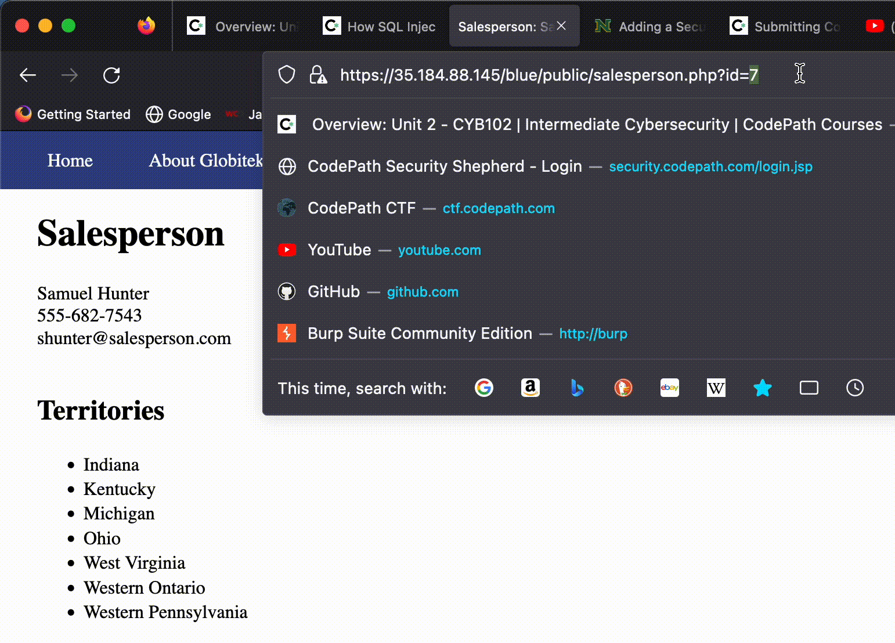
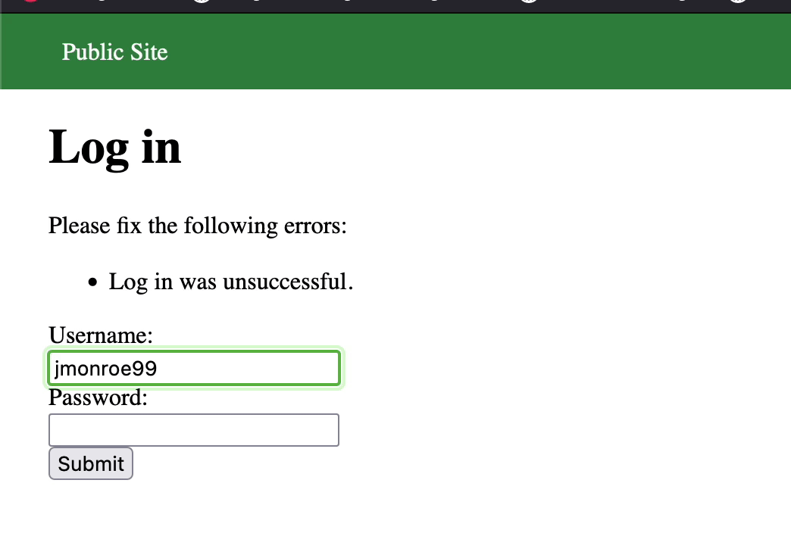

# Pen Testing Live Targets

Time spent: **X** hours spent in total

> Objective: Identify vulnerabilities in three different versions of the Globitek website: blue, green, and red.

The six possible exploits are:

* Username Enumeration
* Insecure Direct Object Reference (IDOR)
* SQL Injection (SQLi)
* Cross-Site Scripting (XSS)
* Cross-Site Request Forgery (CSRF)
* Session Hijacking/Fixation

Each color is vulnerable to only 2 of the 6 possible exploits. First discover which color has the specific vulnerability, then write a short description of how to exploit it, and finally demonstrate it using screenshots compiled into a GIF.

## Blue

Vulnerability #1: SQL Injection

Description: The attacker is able to inject SQL query commands.

Vulnerability #2: Session Hijacking/Fixation

Description: Session ID of a logged-in user is able to be retrieved using the php script provided. An attacker is able to use the victim's session ID and log into the website without credentials.

## Green

Vulnerability #1: Username Enumeration

Description: Attempt to log in with an existing user displays a different text format than a non-registered user, which is useful for an attacker to brute force a log in.

## Red

Vulnerability #1: __________________

Description:

## Notes

Describe any challenges encountered while doing the work

