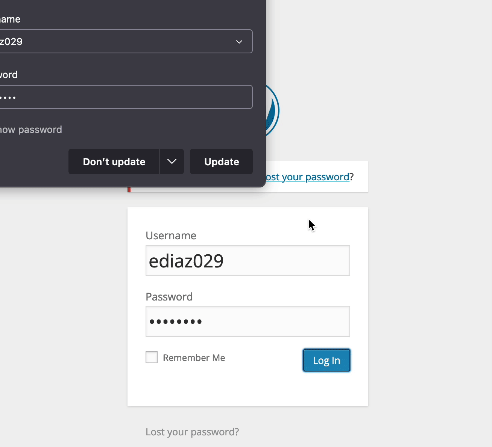
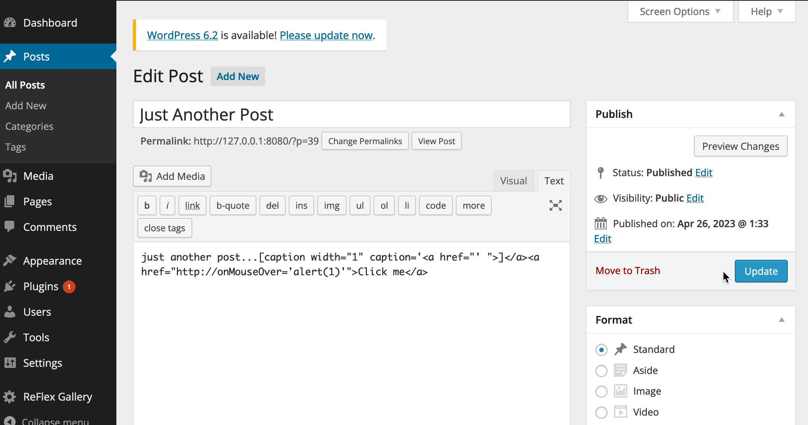

# Project 7 - WordPress Pen Testing

Time spent: 3.5 hours spent in total

> Objective: Find, analyze, recreate, and document **five vulnerabilities** affecting an old version of WordPress

## Pen Testing Report

### 1. Authenticated Stored Cross-Site Scripting (XSS)
 
- [ ] Summary: 
  - Vulnerability types: XSS
  - Tested in version: 4.1
  - Fixed in version: 4.2.3
- [ ] GIF Walkthrough:

- [ ] Steps to recreate: Created a post with (onmouseover()) that runs the script when the mouse hovers over the link.
- [ ] Affected source code:
  - [Link 1](https://core.trac.wordpress.org/browser/tags/version/src/source_file.php)
  
### 2. Unauthenticated Stored Cross-Site Scripting (XSS)

- [ ] Summary: 
  - Vulnerability types: XSS
  - Tested in version: 4.1
  - Fixed in version: 4.2.1
- [ ] GIF Walkthrough: 

- [ ] Steps to recreate: Inserted a comment with JavaScript code alongside over 66,000+ characters (64KB) which executed the script.
- [ ] Affected source code:
  - [Link 1](https://core.trac.wordpress.org/browser/tags/version/src/source_file.php)

### 3. User Enumeration

- [ ] Summary: 
  - Vulnerability types: User Enumeration
  - Tested in version: 4.1
  - Fixed in version: 
- [ ] GIF Walkthrough: 

- [ ] Steps to recreate: Attempted to login with a username and was prompted with the displayed statement which confirms that the username exists.
- [ ] Affected source code:
  - [Link 1](https://core.trac.wordpress.org/browser/tags/version/src/source_file.php)

### 4. Authenticated Shortcode Tags Cross-Site Scripting (XSS)

- [ ] Summary: 
  - Vulnerability types: XSS
  - Tested in version: 4.1
  - Fixed in version: 4.1.8
- [ ] GIF Walkthrough: 

- [ ] Steps to recreate: Added a post composed of shortcode tags which ran the JavaScript code when a mouse hovered over the link.
- [ ] Affected source code:
  - [Link 1](https://core.trac.wordpress.org/browser/tags/version/src/source_file.php) 

## Assets

## Resources

- [WordPress Source Browser](https://core.trac.wordpress.org/browser/)
- [WordPress Developer Reference](https://developer.wordpress.org/reference/)

GIFs created with  ...
<!-- Recommended GIF Tools:
[Kap](https://getkap.co/) for macOS
[ScreenToGif](https://www.screentogif.com/) for Windows
[peek](https://github.com/phw/peek) for Linux. -->

## Notes

Challenges I faced include applying the exploits from what I learned after reading about the vulnerabilities in WordPress.

## License

    Copyright [2023] [Ernesto Diaz]

    Licensed under the Apache License, Version 2.0 (the "License");
    you may not use this file except in compliance with the License.
    You may obtain a copy of the License at

        http://www.apache.org/licenses/LICENSE-2.0

    Unless required by applicable law or agreed to in writing, software
    distributed under the License is distributed on an "AS IS" BASIS,
    WITHOUT WARRANTIES OR CONDITIONS OF ANY KIND, either express or implied.
    See the License for the specific language governing permissions and
    limitations under the License.

